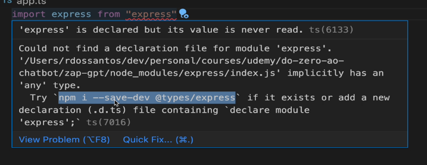

**Passos pra instalação:**

1. npm init --y

2. npm i typescript -D

3. npm i express 

4. npx tsc -init

5. import de tipos das variaveis usando as mensagens de erro

6. criar o arquivo build e o dev no package json (para compilar e rodar o server)

7. descomentar o "rootDir" da pasta tsconfig, e colocar no src

8. fazer parecido com o "outputDir", e colocar na pasta onde vai ficar o arquivo compilado

9. intalar o body-parser e o cors
    npm i body-parser cors

10. instalar depois os tipos das variaveis da biblioteca

11. npm i twilio 

12. adicionar as informações da conta twilio, como account sid, whatsapp number, auth token e etc

13. npm i dotenv 
    para esconder essas informações sensiveis do codigo principal (colocar essas infos no .gitignore)

14. pra testar pode usar *reqbin* (mais facil, mas pra rodar localhost tem que baixar extensao), insomnia, etc

